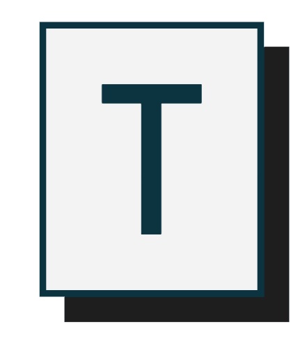

  

<h3 align="center">Typster</h3>

---

 A game to improve your typing skills.
      

## 🧐 About 

A typing game which gives you access to three levels based on difficulty and get a score based on your performance .

## ⛏️ Built Using 

- HTML
- CSS
- Vanilla Javascript

## ✍️ Authors 

- [@ikushaldave](https://github.com/ikushaldave) - [Kushal Dave](). 
- [@celtonlloyd](https://github.com/celtonlloyd) -  [Elton C]() .
- [@AlishaSaxena09](https://github.com/AlishaSaxena09) - [Alisha Saxena]() .
- [@nnkit](https://github.com/nnnkit) - [Ankit Sinha](), Mentor .

## Download 

-  [Version 0.1](https://chrome.google.com/webstore/detail/typster/ffigeilhpmjmppkbfmfedggomhblkjam)

## 🎉 Acknowledgements 

- Hat tip to anyone who helped us.
